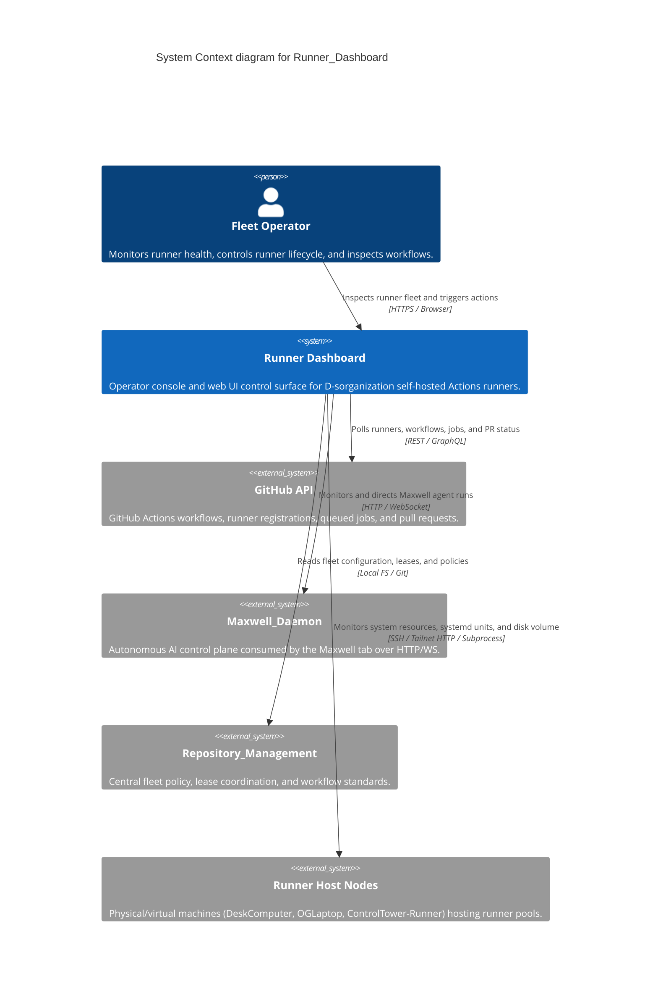
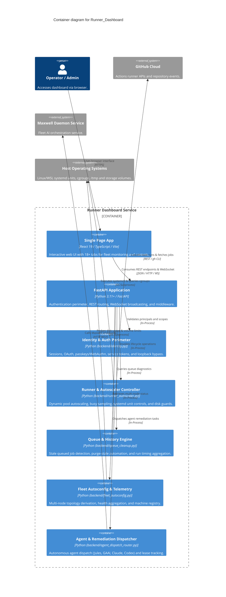

# Architecture Map — Runner_Dashboard

This document defines the canonical Mermaid C4 architecture map for `Runner_Dashboard`, providing verified context, container boundaries, capability-to-component traceability, and architecture change history.

## Context View (C4Context)

## Container View (C4Container)

## Feature Map

| Capability | Component | Interface | Evidence |
| --- | --- | --- | --- |
| Identity & Auth Perimeter | `backend.identity` | `require_principal`, `require_scope`, `require_orchestrator_peer` | `tests/api/test_orchestrator_api.py` |
| Runner Autoscaling & Watchdog | `backend.runner_autoscaler` | `poll_cycle()`, `_default_pool_overloaded()`, `_sd_notify_socket()` | `tests/test_runner_autoscaler.py` |
| Queue Cleanup & Stale Purge | `backend.queue_cleanup` | `/api/queue/stale`, `/api/queue/purge-stale` | `tests/test_queue_cleanup.py` |
| Fleet Topology Aggregation | `backend.fleet_autoconfig` | `assert_valid_active_registry()`, `derive_pool_topology()` | `tests/test_fleet_autoconfig.py` |
| Host Volume Disk Guard | `backend.host_volume` | `get_host_volume_metrics()`, `assert_volume_headroom()` | `tests/test_host_volume.py` |
| Maxwell Contract Integration | `backend.routers.maxwell` | `/api/maxwell/*`, `MaxwellClient` | `tests/test_maxwell_contract.py` |
| Agent Remediation Dispatch | `backend.agent_dispatch_router` | `/api/remediation/dispatch`, `verify_agent_lease` | `tests/test_agent_dispatch.py` |
| Staff Hub (AI staff runs) | `backend.staff` | `/api/staff/*`, `StaffRunner.submit()`, `RunStore` | `tests/api/test_staff_runner.py` |
| Architecture Map Contract | `scripts.architecture_map_contract` | `validate_architecture_map()` | `tests/test_architecture_map_contract.py` |

## Architecture Change Log

| Date | PR / Issue | Description |
| --- | --- | --- |
| 2026-09-22 | #1194 | Add Staff Hub: named AI staff roles run as local CLI subprocesses with a node-local run store and /api/staff routes |
| 2026-09-10 | #1613 | Adopt maintainable Mermaid C4 architecture-map contract and automated CI verification |
